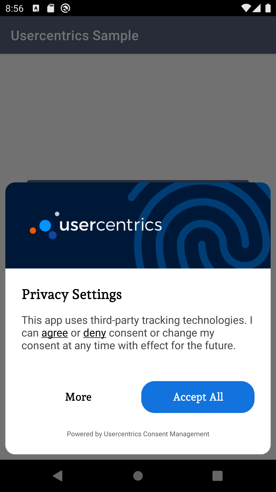
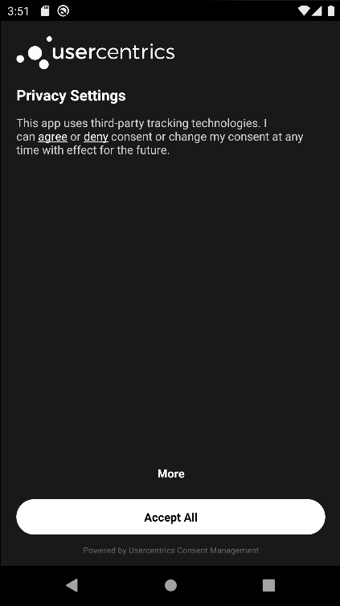
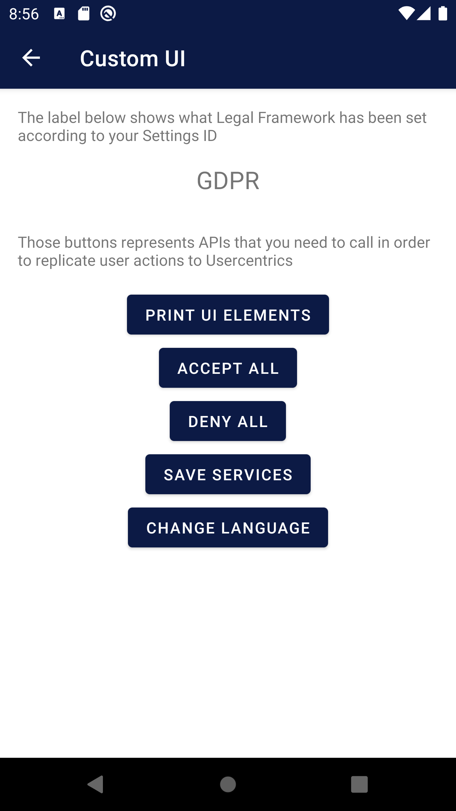

# Usercentrics SDK for Android - Quickstart

The goal of this repository is to show how to use Usercentrics SDK inside of an Android application.

Instructions
------------

* **Step 1:** Clone the repository

* **Step 2:** Open Android Studio and import the project

* **Step 3:** Run

Result
------------

After running the app you should see a screen like this:

Customization Examples
------------

- Example 1:
  

  
- Example 2:
  

Custom UI
------------

This screen will help you understand how you can [build your own CMP](https://docs.usercentrics.com/cmp_in_app_sdk/latest/collect_consent/build_own_cmp/).
We recommend you to interact with all buttons displayed, check your Logcat and don't forget to see the code behind.

Learn more
------------

- For a full overview of our SDK, please see our dedicated [documentation](https://docs.usercentrics.com/cmp_in_app_sdk/latest/).
- For more information and products, check out our [website](https://usercentrics.com).
